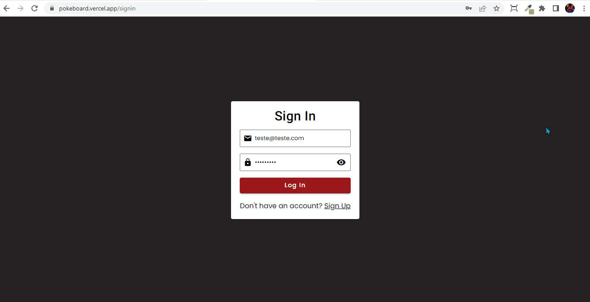
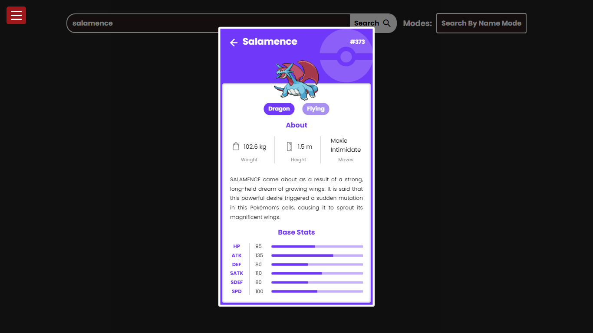

# PokéBoard

The PokéBoard is a web application built with Angular that provides a user-friendly interface for exploring Pokémon data from the PokéAPI. The dashboard incorporates Angular Material and SCSS to enhance the UI design and provide a visually appealing experience.

## Login to Home Footage

## Techs & Tools

- Angular, Angular Router, Angular Material, RxJS, SCSS, UUID, ngx-pagination, ngx-toastr.

## Features

1. **Authentication System:** Users can sign up, log in, and authenticate themselves to access personalized features such as saving favorite Pokémon and managing their profile. The application includes an Auth Guard feature that ensures only logged-in users can access specific routes, providing enhanced security and preventing unauthorized access.

2. **Dashboard Routes:**

- **Board:** This page of the application displays general information and highlights related to some Pokémon and Items.
- **Pokémons:** Allows users to browse and search for Pokémon, fetching data from the PokéAPI. Users can view details, abilities, and characteristics of each Pokémon.
- **Available Modes:**
  Search By Name.
  Search By Quantity.
- **Favorites:** Users can save their favorite Pokémon to easily access them later.
- **My Profile:** Users can view and update their profile information.
- **Angular Material Integration:** The dashboard leverages Angular Material components and styles to ensure a consistent and responsive user interface. Components like buttons, cards, form-fields, and icons are utilized to provide a modern and visually appealing design.

3. **Custom Pipes:** The project implements custom pipes to extend Angular's functionality. Custom pipes provide transformations, such as capitalizing the first letter of each word.

4. **API Integration:** The Pokédex Dashboard interacts with the PokéAPI to fetch Pokémon data dynamically. The application uses HTTP requests to retrieve information such as Pokémon details, abilities, and characteristics, providing a comprehensive view of each Pokémon.

## Setup and Usage

To set up and run the Pokédex Dashboard locally, follow these steps:

1. Clone the repository or download the project files.

2. Ensure you have Node.js and npm installed on your machine.

3. Navigate to the project directory using the command line.

4. Run **npm install**, **ng add @angular/material** and **npm i uuid ngx-pagination ngx-toastr@16.2.0** to install the project dependencies.

5. Run **ng serve** to start the development server.

6. Open your web browser and visit **http://localhost:4200** to access the PokéBoard.

**OR**
Access the project by [clicking here](https://pokeboard.vercel.app/).

## Contributing

Contributions to the PokéBoard are welcome! If you find any bugs, have feature suggestions, or would like to contribute enhancements, feel free to submit issues and pull requests.

When contributing, please adhere to the existing code style, maintain clear commit messages, and ensure adequate test coverage for new features.

## Credits

The Card Modal below was developed based on this Figma template: [Pokémon Card.](<https://www.figma.com/file/bC2qf6Vwwk2hXEyGKRfajL/Pok%C3%A9dex-(Community)?type=design&node-id=0-1&mode=design>)

**PokéAPI Docs:** [docs here.](https://pokeapi.co/docs/v2)

## License

The PokéBoard project is released under the MIT License. You are free to modify and distribute the code as per the terms of the license.

## Contact

For any inquiries or feedback related to the PokéBoard, please reach out to me:

Email: devguiga@gmail.com
Feel free to contact me with any questions, suggestions, or collaboration opportunities related to this project.
